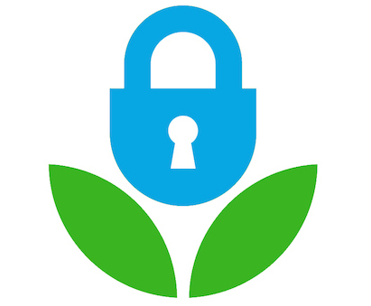

<header>
  
  <h2>datarescueDC</h2>
  <h3>Lauinger Library, Murray Conference Room (Saturday) 
    Reiss Science Building, Room 103 (Sunday) 
    Georgetown University 
    February 18-19
  </h3>
</header>

<iframe src="https://www.google.com/maps/embed?pb=!1m14!1m8!1m3!1d2120.5393250981792!2d-77.07383255877144!3d38.90908820078443!3m2!1i1024!2i768!4f13.1!3m3!1m2!1s0x0%3A0x2e8cec8bb12477d4!2sReiss+Science+Building!5e0!3m2!1sen!2sus!4v1486419654988" width="600" height="450" frameborder="0" style="border:0" allowfullscreen></iframe>

Over the course of two days datarescueDC will help to seed, sort, harvest, and
store valuable and at risk federal government data in [Data Refuge], a project
facilitated by the University of Pennsylvania's Program in Environmental
Humanities. Specifically we will be using this [workflow
model](https://github.com/datarefugephilly/workflow/blob/master/README.md)
developed at the first DataRescue event in Philadelphia, and which has been
further refined at events in Los Angeles, Chicago and Ann Arbor.

Whether you are a researcher who actively uses federal datasets, someone who
values the data publishing work the federal government, a software developer,
designer, or writer who we've got work for you to do, and would love for you 
to be involved.

Please note that participants will need to show a valid photo ID to enter the Lauinger Library, but information is not recorded. 

## Schedule

#### Saturday, February 18th: 12pm to 5:30pm
Lauinger Library, Murray Conference Room

Saturday's sessions will include a teach-in on the importance of climate data (12-1:30 pm), a Guide training for Sunday's team leaders (1:30-4 pm), and a roundtable on open data/data vulnerability (4:15-5:15 pm). Please check back for more details on the teach-in and roundtable, coming soon. You're welcome to come for Saturday events even if you can't come Sunday.

#### Sunday, February 19th: 10am to 5pm
Reiss Science Building, Room 103

Sunday's session will include a creative coding and archive-a-thon. Please bring a fully charged laptop and a charger, a water bottle (fill stations available), and yourself! A light lunch will be provided courtesy of Johns Hopkins University Sheridan Libraries. You're welcome to come for Sunday events even if you can't come Saturday, stay the whole time or come whenever works for you.

Here is some [parking information], note that the visitor lot at Georgetown is cash only. There may also be street parking in the neighborhood.

## Get Involved

Get in touch: [datarescuedc@gmail.com](mailto:datarescuedc@gmail.com ). Press
inquiries should be directed to Annalisa Dias. We have a #datarescuedc channel
going within the [DataRefuge Slack], drop us a line to join the conversation. 

If you would like to attend DataRescueDC please fill out one of the following forms
after reading the information below about the types of teams that we are looking
for and deciding whether you want to work as a guide or not.

* [Participant Registration]
* [Guide Registration]

## Data Rescue Teams

Guides will take you on these Paths: choose one according to your interests and
skills. If you have skills in one of these areas and want to serve as a guide,
please sign up using the [Guide Registration]. If you would like to help out
fill out the [Participant Registration] form. If you'd rather remain anonymous
for now but can fill out an anonymous participant reigstration, that'll help us know how much food to get.

### Seeding & Sorting

Feeding the End of Term Archive: This is the widest path and requires a variety of skill levels. Consider this path if you are a coder, hacker, have front end web experience, or just have a great attention to details.

### DataRefuge Path

These are the various interwoven paths to get "uncrawlable" data into
DataRefuge:

- **Researchers**: to review URLs the Seeders & Sorters mark as Uncrawlable.
Consider this path if you have a strong front end web experience and like to
find out more information about things.

- **Harvesters**: to figure out how to capture the uncrawlable data. Consider
this path if you're a hacker

- **Checkers**: to inspect a harvested dataset and make sure that it is
complete: The main question the checkers need to answer is "will the bag make
sense to a scientist"? Checkers need to have an in-depth understanding of
harvesting goals and potential content variations for datasets.

- **Baggers**: to do a quality assurance check and package the data. Consider
this path if you have data or web archiving experience, or have strong tech
skills AND attention to detail.

- **Describers**: includes a few people from the Baggers path. Consider this
path if you have experience working with scientific data (particularly climate
or environmental data) or with creating metadata. Trained librarians and
scientists will be very helpful on this path.

### Documentation & Storytelling

Calling people with skills in social media, arts, blogging, photography, journalism, and media. Why and to whom does this data matter? How does this data matter to *you* and your community? In what ways do you imagine this data being used in the future? 

A diverse group of people-not just climate scientists-benefit from this information in a number of ways. From archaeologists and city planners, to indigenous communities and local citizens that inhabit coastal towns, this data is valuable to a variety of stakeholders. We welcome you to write a story about *who* and *which* local communities, organizations, and institutions currently use specific datasets, and how.

## Sponsors
* Georgetown University Library
* Johns Hopkins University Sheridan Libraries

## Collaborators

* Sunlight Foundation
* University of Pennsylvania Libraries
* Penn Program in Environmental Humanities
* Environmental Data Governance Initiative (EDGI)
* Climate Mirror
* University of Michigan Libraries
* Internet Archive
* Temple University Libraries
* ProjectARCC
* Union of Concerned Scientists

[DataRefuge Slack]: https://datarefuge.slack.com/messages/datarescuedc/ 
[Data Rescue event]: http://www.ppehlab.org/what-is-a-datarescue-event
[Data Refuge]: https://www.datarefuge.org/
[GitHub]: https://github.com/datarefuge/datarescue-dc 
[this markdown file]: https://github.com/datarefuge/datarescue-dc/blob/master/index.md
[Participant Registration]: https://docs.google.com/forms/d/e/1FAIpQLSdMPvhEbfy12L1XzzjIpSVT5Ux6bRXoFPcDa6ImT1v1W1rEnA/viewform
[Guide Registration]: https://docs.google.com/forms/d/e/1FAIpQLSdfiv-BtQTf94a-HDMl-XnTf07RBIYppJSJ_BEqAX_h5fRVHQ/viewform
[parking information]: https://transportation.georgetown.edu/Driving-and-Parking
